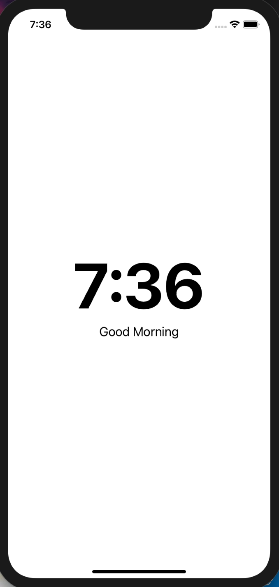
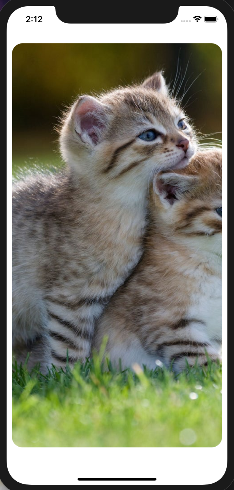
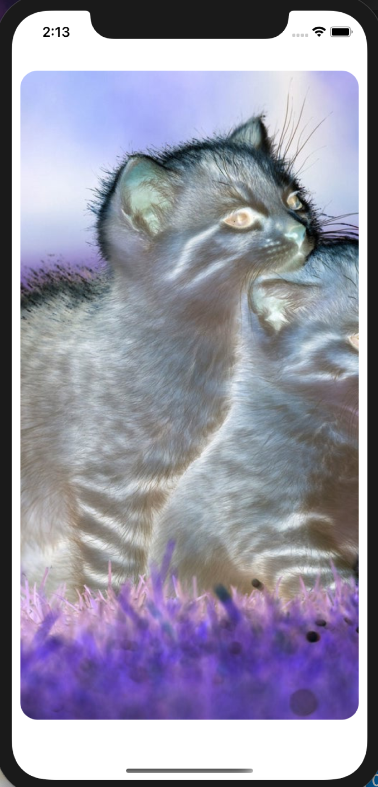

# Hack Technology / Project Attempted
## Irene Lam, Dartmouth CS98.01, Fall 2021

## What you built? 

### Project Clock

To get started, I built a simple clock interface that displays the time and a corresponding greeting message (Good Morning, Good Afternoon, Good Evening). I also used functional components (something I've long since neglected in React), but otherwise nothing too fancy here -- I mainly wanted to set up my React Native environment.

### Project Tinder Swipes 

The motivation of this project was to learn how animations and gestures work in mobile development. To this end, I implemented an app similar to Tinder, in which users are able to interact with cards via the pan gesture, and swipe left and right accordingly. Key lessons in this project involve learning about `Animated.View`, `PanResponder`, as well as its corresponding event handlers.

### With Accessibility

Lastly, I decided to add different forms of accessibility to the Tinder project. As I was not following a tutorial but instead working through documentation, this project took the longest to implement and had varying results. Accessibility features involved included inverting colors (e.g. Classic Invert) and VoiceOver. Accessibility properties I worked with included the following: `accessible`, `accessibilityLabel`, `accessibilityHint`, `accessibilityIgnoresInvertColors`, `TouchableOpacity`, `accessibilityRole`, `onAccessibilityTap` and `onMagicTap`. Please note that I personally have an iPhone and consequently focused on iOS-specific accessibility features for best results (in testing).

**Classic Invert**

| Regular Experience      | Classic Invert |
| ----------- | ----------- |
|       |        |

To accomodate a user who may use classic invert, it's important to keep the colors of the original picture the same. In the app, all images have been adjusted with `accessibilityIgnoresInvertColors`, but for the purposes of demonstration and distinction, I only treated the top most image in the following gif:

**VoiceOver**

This was by far the hardest part of this hack, for no reason other than when VoiceOver is enabled, all gesture recognizers are disabled, which completely contradicts how Tinder swipes work. Moreover, because VoiceOver is for the visually impaired, the fact that there are no words made the experience even less accessible. To this end, I added `accessibilityLabel` and `accessibilityHint` for descriptions on the image, as well as cues on how the user can proceed. I also experimented with `TouchableOpacity` and `accessibilityRole`, but neither showed results so they have been removed from the code. Lastly, I tried using `onAccessibilityTap` and `onMagicTap` to mimic a pseudo pan gesture, but the results were not up to par. Given more time, I would follow an accessibility tutorial from start to finish (the tutorials I found were few and far between, which is why I originally believed that experimenting on my own with documentation would have been preferrable).

## Who Did What?

I hacked at these projects alone!

## What you learned

### What Worked + Lessons

* **Project Clock:** I was honestly really surprised I could start up the app. Up until this point, I had either worked on preexisting React Native code or followed a tutorial to get the app working. Now given the opportunity to start from scratch, I realize that starting fresh was not as unnerving as I made it out to be (although I still had my fair share of pitfalls, more below...)
* **Project Tinder:** This was probably the most successful of all my endeavors. I chose this project because of its emphasis on the pan gesture, which was the main feature from my CS52 project my team tried -- and failed-- to implement. Now that I had the time to follow a tutorial, I am more familiar with the `PanResponder` as well as its corresponding event handlers. More successful, however, were the animations that worked exactly as intended. It was exciting to see how rotations, translations, and changes to opacity (nothing too crazy) were able to create sliding cards that appeared so fluidly. I also learned about interpolations and the spring effect, both of which I would be more than happy to use given the opportunity.
* **Accessibility:** This wasn't quite as successful as the other two, largely due to the fact that I was building off another codebase and had less flexibility, and do not have a recent iPhone for testing (many accessibility features required iOS 11+, and the iOS simulator was unable to work with VoiceOver). Nevertheless, I learned the most and worked the longest in this part of the hack. With the color invert, I was able to see the difference between how most images do not account for inversion accessibility. It was also really exciting to see how adding accessibility labels made a big difference when users otherwise would not be able to interact with the photos on the screen.

### What Didn't Work + Lessons

* **Project Clock:** For the longest time, I couldn't run my app because I was sure I had the right path to my component. As it turns out, I created the component directory outside the repository. I learned how important it was to take a step back for this one...and to trust the error output. 
* **Project Tinder:** This was mostly smooth-sailing because I followed a tutorial. I did get stumped on working with the `PanResponder` because the error message said the code was in typescript. Moving the code to `componentWillMount` resolved this issue, and got me much more familiar with the React lifecycle.
* **Accessibility (VoiceOver):** This was the main feature that I dedicated time to, which unfortunately did not work/ did not produce results. From the beginning, I noticed that changes showing in the iOS simulator were not reflected on my iPhone (potentially because of my phone's dated model). The simulator was not able to use VoiceOver, and while I tried working with my phone in the beginning, much of the end result are untested ideas I had to make Tinder Swipes accessible (though I would ideally like to use an iPhone for testing). The main issue I found working with this was that VoiceOver was mainly used by the visually impaired, who themselves relied on pan gestures to understand what each part of their screen displayed. This interefered with the Project Tinder's swipes, especially considering how VoiceOver controls have a largely different system where taps and gestures can create unintended effects. Ultimately, I found that many apps are not accessible, and given the opportunity in the future, I recognize that accessibility should be an intentional part of the design process as opposed to a fun extra for the end.  

## Authors

Irene Lam (irene.x.lam.22@dartmouth.edu)

## Acknowledgments

[Tinder Swipe](https://www.instamobile.io/react-native-controls/react-native-swipe-cards-tinder/)

**(Documentation)**

[React Native Accessibility Docs](https://reactnative.dev/docs/accessibility)

[Useful Medium Article on Commonly Used Accessibility Features in Coding](https://medium.com/@larenelg/creating-inclusive-apps-in-react-native-the-coding-bit-bd3832349009)
